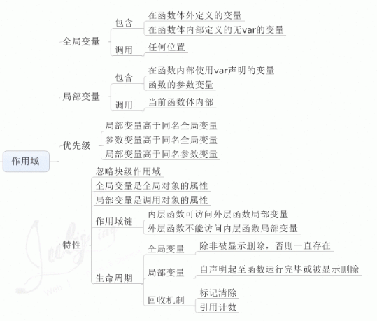
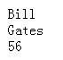
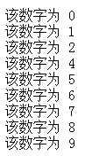
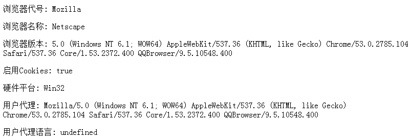

## 常用命令

### git 常用命令

```bash
//只克隆仓库中的一个分支
git clone -b <branch_name> <repo>

git clone -b v2 http://git.showgold.cn:8081/wabg/download.git
```

## Javascript相关知识

DOM (Document Object Model)（文档对象模型）是用于访问 HTML 元素的正式 W3C 标准。

外部的JavaScript文件不能包含 &lt;script&gt; 标签。

JavaScript 可以通过不同的方式来输出数据：
* 使用 window.alert() 弹出警告框。
* 使用 document.write() 方法将内容写到 HTML 文档中。
* 使用 innerHTML 写入到 HTML 元素。
* 使用 console.log() 写入到浏览器的控制台。

#### JavaScript 变量
* 变量必须以字母开头
* 变量也能以 $ 和 _ 符号开头（不过我们不推荐这么做）
* 变量名称对大小写敏感（y 和 Y 是不同的变量）

#### 变量作用域



如果变量在函数内没有声明（没有使用 var 关键字），该变量为全局变量。<br>
以下实例中 carName 在函数内，但是为全局变量。<br>
```javascript
// 此处可调用 carName 变量

function myFunction() {
    carName = "Volvo";

    // 此处可调用 carName 变量

}
```

#### for···in 循环

for···in 语句循环遍历对象的`属性`，例：
```javascript
function myFunction(){
	var x;
	var txt="";
	var person={fname:"Bill",lname:"Gates",age:56}; 
	for (x in person){
		txt=txt + person[x]+"<br>";
	}
	document.getElementById("demo").innerHTML=txt;
}
```

结果：



#### continue 语句

continue 语句中断循环中的迭代，如果出现了指定的条件，然后继续循环中的下一个迭代。 该例子跳过了值 3：
```javascript
function myFunction(){
	var x="",i=0;
	for (i=0;i<10;i++){
  		if (i==3){
    		continue;
    	}
		x=x + "该数字为 " + i + "<br>";
  	}
	document.getElementById("demo").innerHTML=x;
}
```

结果：



#### constructor 属性

constructor 属性返回所有 JavaScript 变量的构造函数。


#### 转为字符串

* 全局方法 String()
	```javascript
	String(x)         // 将变量 x 转换为字符串并返回
	String(123)       // 将数字 123 转换为字符串并返回
	String(100 + 23)  // 将数字表达式转换为字符串并返回，结果为123
	```

* toString()
	```javascript
	x.toString()
	(123).toString()
	(100 + 23).toString()
	```

#### 字符串转为数组 split()
```javascript
var str="How are you doing today?"

document.write(str.split(" ") + "<br />")
//输出： How,are,you,doing,today?

document.write(str.split("") + "<br />")
//输出： H,o,w, ,a,r,e, ,y,o,u, ,d,o,i,n,g, ,t,o,d,a,y,?
```
#### 特殊字符
| 代码          | 输出      |
| ------------- | --------------- |
| \'         | 单引号      |
| \"         | 双引号      |
| \\\         | 斜杆      |
| \n         | 换行      |
| \r         | 回车      |
| \t         | tab      |
| \b         | 空格      |
| \f         | 换页      |

#### 转为数字 Number()

空字符串转换为 0。<br>
其他的字符串会转换为 NaN (不是个数字)。

```javascript
Number("3.14")    // 返回 3.14
Number(" ")       // 返回 0 
Number("")        // 返回 0
Number("99 88")   // 返回 NaN
Number(false)     // 返回 0
Number(true)      // 返回 1
```

#### search() & replace()使用正则表达式

```javascript
var str = "Visit w3cschool";
var n = str.search(/w3cschool/i);      //i：表示不区分大小写。结果返回子字符串的起始位置6
```

```javascript
var str = "Visit Microsoft!";
var res = str.replace(/microsoft/i, "w3cschool");     //结果为：Visit w3cschool!
```

#### 正则表达式修饰符   [More about RegExp](http://www.w3cschool.cn/jsref/jsref-obj-regexp.html)

| 修饰符         | 描述      |
| ------------- | --------------- |
| i             | 执行对大小写不敏感的匹配。    |
| g             | 执行全局匹配（查找所有匹配而非在找到第一个匹配后停止）。 |
| m             | 执行多行匹配。   |

#### test() & exec()

test() : 如果字符串中含有匹配的文本，则返回 true，否则返回 false。
```javascript
/e/.test("The best things in life are free!")      //结果为 true
```

exec() ： 该函数返回一个数组，其中存放匹配的结果。如果未找到匹配，则返回值为 null。
```javascript
/are/.exec("The best things in life are free!");     //结果为 are
```

#### match()函数

match()函数用来查找字符串中特定的字符，并且如果找到的话，则返回这个字符。

```javascript
var str="Hello world!";
document.write(str.match("World") + "<br>");    //结果为：null
document.write(str.match("world!"));        //结果为：world!
```

#### [&lt;form&gt; 标签的 method 属性](http://www.w3school.com.cn/tags/att_form_method.asp)

method 属性规定如何发送表单数据（表单数据发送到 action 属性所规定的页面）。<br>
表单数据可以作为 URL 变量（method="get"，GET 方法将表单参数直接放在URL 中）或者 HTTP post （method="post"，加密）的方式来发送。

#### JSON 语法规则

* 数据为 键/值 对。
* 数据由逗号分隔。
* 大括号保存对象
* 方括号保存数组

#### href="#"与href="javascript:void(0)"的区别

\# 包含了一个位置信息，默认的锚是\#top 也就是网页的上端。而javascript:void(0), 仅仅表示一个死链接。<br>
在页面很长的时候会使用 \# 来定位页面的具体位置，格式为：\# + id。<br>
如果你要定义一个死链接请使用 javascript:void(0) 。

#### Arguments 对象

arguments 对象包含了函数调用的参数数组。

```javascript
x = findMax(1, 123, 500, 115, 44, 88);

function findMax() {
    var i, max = 0;
    for (i = 0; i < arguments.length; i++) {
        if (arguments[i] > max) {
            max = arguments[i];
        }
    }
    return max;
}
```

#### onload 和 onunload 事件

onload 和 onunload 事件会在用户进入或离开页面时被触发。onload 事件可用于检测访问者的浏览器类型和浏览器版本，并基于这些信息来加载网页的正确版本。onload 和 onunload 事件可用于处理 cookie。

```javascript
<body onload="checkCookies()">
	<script>
	function checkCookies(){
		if (navigator.cookieEnabled==true){
			alert("Cookies 可用")
		}
		else{
			alert("Cookies 不可用")
		}
	}
	</script>	
</body>
```

#### addEventListener() 方法
```javascript
document.getElementById("myBtn").addEventListener("click", displayDate);
```
你可以使用 removeEventListener() 方法来移除事件的监听。

`注意:不要使用 "on" 前缀。 例如，使用 "click" ,而不是使用 "onclick"。`

#### 事件冒泡和事件捕获

在 *冒泡* 中，内部元素的事件会先被触发，然后再触发外部元素。在 *捕获* 中，外部元素的事件会先被触发，然后才会触发内部元素的事件。<br>
addEventListener() 方法可以指定 "useCapture" 参数来设置传递类型：<br>
```javascript
addEventListener(event, function, useCapture);
```
默认值为 false, 即冒泡传递，当值为 true 时, 事件使用捕获传递。

#### 创建文本节点

```javascript
var node=document.createTextNode("This is a new paragraph.");
```

#### 八进制和十六进制

如果前缀为 0，则 JavaScript 会把数值常量解释为八进制数，如果前缀为 0 和 "x"，则解释为十六进制数。

```javascript
var y = 0377;
var z = 0xFF; 
document.write(y + "<br>");     //255，(7*8^0 + 7*8^1 + 3*8^2)
document.write(z + "<br>");     //255，(15*16^0 + 15*16^1)
```
16进制即逢16进1，其中用A，B，C，D，E，F（字母不区分大小写）这六个字母来分别表示10，11，12，13，14，15。故而有16进制每一位上可以是从小到大为0、1、2、3、4、5、6、7、8、9、A、B、C、D、E、F共16个大小不同的数。

#### 在网页上显示一个钟表
```html
<head>
	<script>
	function startTime(){
		var today=new Date();
		var h=today.getHours();
		var m=today.getMinutes();
		var s=today.getSeconds();
		// 在小于10的数字钱前加一个‘0’
		m=checkTime(m);
		s=checkTime(s);
		document.getElementById('txt').innerHTML=h+":"+m+":"+s;
		t=setTimeout(function(){startTime()},500);
	}
	function checkTime(i){
		if (i<10){
			i="0" + i;
		}
		return i;
	}
	</script>
</head>

<body onload="startTime()">	
	<div id="txt"></div>
</body>
```
效果：

16:10:05

#### setInterval()显示时钟
```javascript
var myVar=setInterval(function(){myTimer()},1000);
function myTimer(){
	var d=new Date();
	var t=d.toLocaleTimeString();
	document.getElementById("demo").innerHTML=t;
}
```
效果：

下午9:47:03

#### 可以不使用 window 这个前缀的：
*screen.availWidth* - 可用的屏幕宽度<br>
*screen.availHeight* - 可用的屏幕高度


*location.hostname* - 返回 web 主机的域名<br>
*location.pathname* - 返回当前页面的路径和文件名<br>
*location.port* - 返回 web 主机的端口 （80 或 443）<br>
*location.protocol* - 返回所使用的 web 协议（http:// 或 https://）<br>
*location.href* - 返回当前页面的 URL<br>
*location.assign* - 加载新的文档


*history.back()* - 加载历史列表中的前一个 URL。这与在浏览器中点击后退按钮是相同的。<br>
*history.forward()* - 加载历史列表中的下一个 URL。这与在浏览器中点击前进按钮是相同的。


**window.navigator** 对象在编写时可不使用 window 这个前缀。
```html
<div id="example"></div>

<script>
txt = "<p>浏览器代号: " + navigator.appCodeName + "</p>";
txt+= "<p>浏览器名称: " + navigator.appName + "</p>";
txt+= "<p>浏览器版本: " + navigator.appVersion + "</p>";
txt+= "<p>启用Cookies: " + navigator.cookieEnabled + "</p>";
txt+= "<p>硬件平台: " + navigator.platform + "</p>";
txt+= "<p>用户代理: " + navigator.userAgent + "</p>";
txt+= "<p>用户代理语言: " + navigator.systemLanguage + "</p>";
document.getElementById("example").innerHTML=txt;
</script>
```


#### setInterval() & setTimeout()
* setInterval()的第二个参数指间隔的毫秒数
* setTimeout()的第二个参数指从当前起多少毫秒后执行第一个参数